# 🦉 NEUROPLAY - PLANO DE FLUXOGRAMA PARA EXPORTAÇÃO

## FORMATO Mermaid (GitHub, GitLab, Notion)

### 1. DIAGRAMA PRINCIPAL DO SISTEMA

```mermaid
graph TD
    A[Usuário Acessa] --> B{Primeira Visita?}
    B -->|Sim| C[Landing Page]
    B -->|Não| D[Login]
    C --> D
    D --> E{Autenticação}
    E -->|Sucesso| F[Dashboard]
    E -->|Falha| D
    F --> G{Tipo de Usuário}
    G -->|Admin| H[Funcionalidades Admin]
    G -->|Avaliador| I[Funcionalidades Avaliador]
    
    H --> J[Gerenciar Avaliadores]
    H --> K[Gerenciar Crianças]
    H --> L[Relatórios Gerais]
    H --> M[Personalizar Sistema]
    H --> N[Logs de Auditoria]
    
    I --> O[Minhas Crianças]
    I --> P[Realizar Avaliações]
    I --> Q[Histórico de Avaliações]
    I --> R[Gerenciar Perguntas]
```



### 2. FLUXO DE AVALIAÇÃO

```mermaid
flowchart TD
    A[Selecionar Criança] --> B[Calcular Idade]
    B --> C[Filtrar Perguntas por Idade]
    C --> D[Apresentar Formulário]
    D --> E[Coletar Respostas por Categoria]
    E --> F[Socialização]
    E --> G[Linguagem]
    E --> H[Cognição]
    E --> I[Autocuidados]
    E --> J[Desenvolvimento Motor]
    
    F --> K[Calcular Estatísticas]
    G --> K
    H --> K
    I --> K
    J --> K
    
    K --> L[Salvar Avaliação]
    L --> M[Gerar Relatório]
    M --> N[Exibir Gráficos]
    N --> O[Atualizar Dashboard]
```



### 3. ESTRUTURA DE DADOS


## FORMATO Draw.io/Lucidchart (XML/JSON)

### 4. ESTRUTURA XML PARA DRAW.IO

```xml
<mxfile>
  <diagram name="NeuroPlay Sistema Principal">
    <mxGraphModel>
      <root>
        <mxCell id="0"/>
        <mxCell id="1" parent="0"/>
        
        <!-- Nós principais -->
        <mxCell id="usuario" value="Usuário" style="ellipse;fillColor=#e1d5e7;strokeColor=#9673a6;" vertex="1" parent="1">
          <mxGeometry x="100" y="50" width="80" height="40" as="geometry"/>
        </mxCell>
        
        <mxCell id="landing" value="Landing Page" style="rounded=1;whiteSpace=wrap;html=1;fillColor=#d5e8d4;strokeColor=#82b366;" vertex="1" parent="1">
          <mxGeometry x="250" y="50" width="100" height="40" as="geometry"/>
        </mxCell>
        
        <mxCell id="login" value="Login" style="rounded=1;whiteSpace=wrap;html=1;fillColor=#fff2cc;strokeColor=#d6b656;" vertex="1" parent="1">
          <mxGeometry x="400" y="50" width="80" height="40" as="geometry"/>
        </mxCell>
        
        <mxCell id="dashboard" value="Dashboard" style="rounded=1;whiteSpace=wrap;html=1;fillColor=#dae8fc;strokeColor=#6c8ebf;" vertex="1" parent="1">
          <mxGeometry x="550" y="50" width="100" height="40" as="geometry"/>
        </mxCell>
        
        <!-- Decisão de tipo de usuário -->
        <mxCell id="decisao" value="Tipo de Usuário?" style="rhombus;whiteSpace=wrap;html=1;fillColor=#ffe6cc;strokeColor=#d79b00;" vertex="1" parent="1">
          <mxGeometry x="550" y="150" width="100" height="60" as="geometry"/>
        </mxCell>
        
        <!-- Funcionalidades Admin -->
        <mxCell id="admin" value="Admin" style="rounded=1;whiteSpace=wrap;html=1;fillColor=#f8cecc;strokeColor=#b85450;" vertex="1" parent="1">
          <mxGeometry x="400" y="250" width="80" height="40" as="geometry"/>
        </mxCell>
        
        <!-- Funcionalidades Avaliador -->
        <mxCell id="avaliador" value="Avaliador" style="rounded=1;whiteSpace=wrap;html=1;fillColor=#d5e8d4;strokeColor=#82b366;" vertex="1" parent="1">
          <mxGeometry x="700" y="250" width="80" height="40" as="geometry"/>
        </mxCell>
        
        <!-- Conexões -->
        <mxCell id="edge1" edge="1" parent="1" source="usuario" target="landing">
          <mxGeometry relative="1" as="geometry"/>
        </mxCell>
        
        <mxCell id="edge2" edge="1" parent="1" source="landing" target="login">
          <mxGeometry relative="1" as="geometry"/>
        </mxCell>
        
        <mxCell id="edge3" edge="1" parent="1" source="login" target="dashboard">
          <mxGeometry relative="1" as="geometry"/>
        </mxCell>
        
        <mxCell id="edge4" edge="1" parent="1" source="dashboard" target="decisao">
          <mxGeometry relative="1" as="geometry"/>
        </mxCell>
        
        <mxCell id="edge5" edge="1" parent="1" source="decisao" target="admin">
          <mxGeometry relative="1" as="geometry"/>
        </mxCell>
        
        <mxCell id="edge6" edge="1" parent="1" source="decisao" target="avaliador">
          <mxGeometry relative="1" as="geometry"/>
        </mxCell>
        
      </root>
    </mxGraphModel>
  </diagram>
</mxfile>
```

## FORMATO VISIO (VSDX)

### 5. ESTRUTURA PARA VISIO

```json
{
  "visioDocument": {
    "pages": [
      {
        "name": "NeuroPlay Sistema Principal",
        "shapes": [
          {
            "id": "1",
            "type": "ellipse",
            "text": "Usuário",
            "x": 100,
            "y": 50,
            "width": 80,
            "height": 40,
            "fillColor": "#e1d5e7",
            "strokeColor": "#9673a6"
          },
          {
            "id": "2",
            "type": "rectangle",
            "text": "Landing Page",
            "x": 250,
            "y": 50,
            "width": 100,
            "height": 40,
            "fillColor": "#d5e8d4",
            "strokeColor": "#82b366"
          },
          {
            "id": "3",
            "type": "rectangle",
            "text": "Login",
            "x": 400,
            "y": 50,
            "width": 80,
            "height": 40,
            "fillColor": "#fff2cc",
            "strokeColor": "#d6b656"
          },
          {
            "id": "4",
            "type": "rectangle",
            "text": "Dashboard",
            "x": 550,
            "y": 50,
            "width": 100,
            "height": 40,
            "fillColor": "#dae8fc",
            "strokeColor": "#6c8ebf"
          },
          {
            "id": "5",
            "type": "diamond",
            "text": "Tipo de Usuário?",
            "x": 550,
            "y": 150,
            "width": 100,
            "height": 60,
            "fillColor": "#ffe6cc",
            "strokeColor": "#d79b00"
          }
        ],
        "connectors": [
          {
            "from": "1",
            "to": "2",
            "label": "Acessa"
          },
          {
            "from": "2",
            "to": "3",
            "label": "Navega"
          },
          {
            "from": "3",
            "to": "4",
            "label": "Autentica"
          },
          {
            "from": "4",
            "to": "5",
            "label": "Verifica"
          }
        ]
      }
    ]
  }
}
```

## FORMATO BPMN 2.0

### 6. PROCESSO DE AVALIAÇÃO EM BPMN

```xml
<?xml version="1.0" encoding="UTF-8"?>
<bpmn:definitions xmlns:bpmn="http://www.omg.org/spec/BPMN/20100524/MODEL">
  <bpmn:process id="ProcessoAvaliacao" name="Processo de Avaliação NeuroPlay">
    
    <!-- Evento de início -->
    <bpmn:startEvent id="StartEvent" name="Início da Avaliação">
      <bpmn:outgoing>Flow1</bpmn:outgoing>
    </bpmn:startEvent>
    
    <!-- Tarefa: Selecionar Criança -->
    <bpmn:task id="Task1" name="Selecionar Criança">
      <bpmn:incoming>Flow1</bpmn:incoming>
      <bpmn:outgoing>Flow2</bpmn:outgoing>
    </bpmn:task>
    
    <!-- Tarefa: Calcular Idade -->
    <bpmn:task id="Task2" name="Calcular Idade">
      <bpmn:incoming>Flow2</bpmn:incoming>
      <bpmn:outgoing>Flow3</bpmn:outgoing>
    </bpmn:task>
    
    <!-- Gateway: Verificar se há perguntas -->
    <bpmn:exclusiveGateway id="Gateway1" name="Há perguntas para esta idade?">
      <bpmn:incoming>Flow3</bpmn:incoming>
      <bpmn:outgoing>Flow4</bpmn:outgoing>
      <bpmn:outgoing>Flow5</bpmn:outgoing>
    </bpmn:exclusiveGateway>
    
    <!-- Tarefa: Realizar Avaliação -->
    <bpmn:task id="Task3" name="Realizar Avaliação">
      <bpmn:incoming>Flow4</bpmn:incoming>
      <bpmn:outgoing>Flow6</bpmn:outgoing>
    </bpmn:task>
    
    <!-- Tarefa: Calcular Resultados -->
    <bpmn:task id="Task4" name="Calcular Resultados">
      <bpmn:incoming>Flow6</bpmn:incoming>
      <bpmn:outgoing>Flow7</bpmn:outgoing>
    </bpmn:task>
    
    <!-- Tarefa: Salvar Avaliação -->
    <bpmn:task id="Task5" name="Salvar Avaliação">
      <bpmn:incoming>Flow7</bpmn:incoming>
      <bpmn:outgoing>Flow8</bpmn:outgoing>
    </bpmn:task>
    
    <!-- Evento de fim -->
    <bpmn:endEvent id="EndEvent" name="Avaliação Concluída">
      <bpmn:incoming>Flow8</bpmn:incoming>
    </bpmn:endEvent>
    
    <!-- Fluxos -->
    <bpmn:sequenceFlow id="Flow1" sourceRef="StartEvent" targetRef="Task1"/>
    <bpmn:sequenceFlow id="Flow2" sourceRef="Task1" targetRef="Task2"/>
    <bpmn:sequenceFlow id="Flow3" sourceRef="Task2" targetRef="Gateway1"/>
    <bpmn:sequenceFlow id="Flow4" sourceRef="Gateway1" targetRef="Task3" name="Sim"/>
    <bpmn:sequenceFlow id="Flow5" sourceRef="Gateway1" targetRef="EndEvent" name="Não"/>
    <bpmn:sequenceFlow id="Flow6" sourceRef="Task3" targetRef="Task4"/>
    <bpmn:sequenceFlow id="Flow7" sourceRef="Task4" targetRef="Task5"/>
    <bpmn:sequenceFlow id="Flow8" sourceRef="Task5" targetRef="EndEvent"/>
    
  </bpmn:process>
</bpmn:definitions>
```

## FORMATO PlantUML

### 7. DIAGRAMA DE ATIVIDADES

```plantuml
@startuml NeuroPlay Activity Diagram
!theme plain
skinparam activity {
  BackgroundColor #E1F5FE
  BorderColor #01579B
  FontColor #000000
}

start
:Usuário acessa o sistema;
if (Primeira visita?) then (sim)
  :Exibir Landing Page;
else (não)
  :Redirecionar para Login;
endif

:Realizar Login;
if (Autenticação válida?) then (sim)
  :Acessar Dashboard;
  if (Tipo de usuário?) then (Admin)
    :Gerenciar Avaliadores;
    :Gerenciar Crianças;
    :Visualizar Relatórios Gerais;
    :Personalizar Sistema;
    :Acessar Logs de Auditoria;
  else (Avaliador)
    :Visualizar Minhas Crianças;
    :Realizar Avaliações;
    :Visualizar Histórico;
    :Gerenciar Perguntas;
  endif
else (não)
  :Exibir erro de login;
  stop
endif

stop
@enduml
```



### 8. DIAGRAMA DE SEQUÊNCIA - PROCESSO DE AVALIAÇÃO

```plantuml
@startuml NeuroPlay Sequence Diagram
!theme plain

actor Usuário as U
participant "Interface Web" as I
participant "Sistema PHP" as P
participant "Banco MySQL" as B

U -> I: Seleciona criança para avaliar
I -> P: Envia ID da criança
P -> B: Busca dados da criança
B --> P: Retorna dados
P -> P: Calcula idade da criança
P -> B: Busca perguntas por faixa etária
B --> P: Retorna perguntas filtradas
P --> I: Exibe formulário de avaliação

U -> I: Preenche respostas
I -> P: Envia respostas
P -> P: Calcula estatísticas
P -> B: Salva avaliação
B --> P: Confirma salvamento
P -> B: Salva respostas individuais
B --> P: Confirma salvamento
P --> I: Exibe confirmação
I --> U: Mostra resultado da avaliação

@enduml
```

## FORMATO C4 Model

### 9. DIAGRAMA DE CONTEXTO

```mermaid
C4Context
    title Sistema NeuroPlay - Diagrama de Contexto
    
    Person(usuario, "Usuário", "Admin ou Avaliador do sistema")
    Person(responsavel, "Responsável", "Pai/Mãe da criança")
    
    System(neuroplay, "NeuroPlay", "Sistema de avaliação do desenvolvimento infantil")
    
    System_Ext(banco, "MySQL Database", "Banco de dados para persistência")
    System_Ext(servidor, "Servidor Web", "Apache/Nginx com PHP")
    
    Rel(usuario, neuroplay, "Usa", "HTTPS")
    Rel(responsavel, neuroplay, "Cadastra criança", "HTTPS")
    Rel(neuroplay, banco, "Persiste dados", "SQL")
    Rel(neuroplay, servidor, "Executa em", "PHP")
```



### 10. DIAGRAMA DE CONTAINER


## FORMATO PARA LUCIDCHART

### 11. ESTRUTURA JSON PARA LUCIDCHART

```json
{
  "version": "1.0",
  "title": "NeuroPlay - Sistema de Avaliação Infantil",
  "pages": [
    {
      "id": "page1",
      "name": "Fluxo Principal",
      "shapes": [
        {
          "id": "start",
          "type": "ellipse",
          "x": 100,
          "y": 100,
          "width": 80,
          "height": 40,
          "text": "Início",
          "style": {
            "fill": "#E8F5E8",
            "stroke": "#4CAF50"
          }
        },
        {
          "id": "landing",
          "type": "rectangle",
          "x": 250,
          "y": 100,
          "width": 120,
          "height": 50,
          "text": "Landing Page",
          "style": {
            "fill": "#E3F2FD",
            "stroke": "#2196F3"
          }
        },
        {
          "id": "login",
          "type": "rectangle",
          "x": 400,
          "y": 100,
          "width": 100,
          "height": 50,
          "text": "Login",
          "style": {
            "fill": "#FFF3E0",
            "stroke": "#FF9800"
          }
        },
        {
          "id": "dashboard",
          "type": "rectangle",
          "x": 550,
          "y": 100,
          "width": 120,
          "height": 50,
          "text": "Dashboard",
          "style": {
            "fill": "#F3E5F5",
            "stroke": "#9C27B0"
          }
        },
        {
          "id": "decisao",
          "type": "diamond",
          "x": 550,
          "y": 200,
          "width": 120,
          "height": 80,
          "text": "Tipo de\nUsuário?",
          "style": {
            "fill": "#FFECB3",
            "stroke": "#FFC107"
          }
        }
      ],
      "connectors": [
        {
          "id": "conn1",
          "from": "start",
          "to": "landing",
          "label": "Acessa"
        },
        {
          "id": "conn2",
          "from": "landing",
          "to": "login",
          "label": "Navega"
        },
        {
          "id": "conn3",
          "from": "login",
          "to": "dashboard",
          "label": "Autentica"
        },
        {
          "id": "conn4",
          "from": "dashboard",
          "to": "decisao",
          "label": "Verifica"
        }
      ]
    }
  ]
}
```

## INSTRUÇÕES DE EXPORTAÇÃO

### Para Mermaid:
1. Copie o código Mermaid
2. Cole em: https://mermaid.live/ ou GitHub/GitLab
3. Exporte como PNG, SVG ou PDF

### Para Draw.io:
1. Acesse: https://app.diagrams.net/
2. Importe o XML fornecido
3. Edite conforme necessário
4. Exporte como PNG, PDF, SVG, etc.

### Para Lucidchart:
1. Acesse: https://www.lucidchart.com/
2. Crie novo documento
3. Importe o JSON fornecido
4. Personalize e exporte

### Para Visio:
1. Abra Microsoft Visio
2. Crie novo diagrama
3. Use o JSON como referência
4. Exporte como VSDX, PNG, PDF

### Para PlantUML:
1. Acesse: http://www.plantuml.com/plantuml/
2. Cole o código PlantUML
3. Gere a imagem
4. Exporte como PNG, SVG, PDF

### Para BPMN:
1. Use ferramentas como: Camunda Modeler, Bizagi Modeler
2. Importe o XML BPMN 2.0
3. Edite e exporte

---

**NOTA:** Este arquivo contém todos os formatos necessários para criar fluxogramas profissionais do sistema NeuroPlay em diferentes plataformas. Escolha o formato mais adequado para sua ferramenta de preferência.
